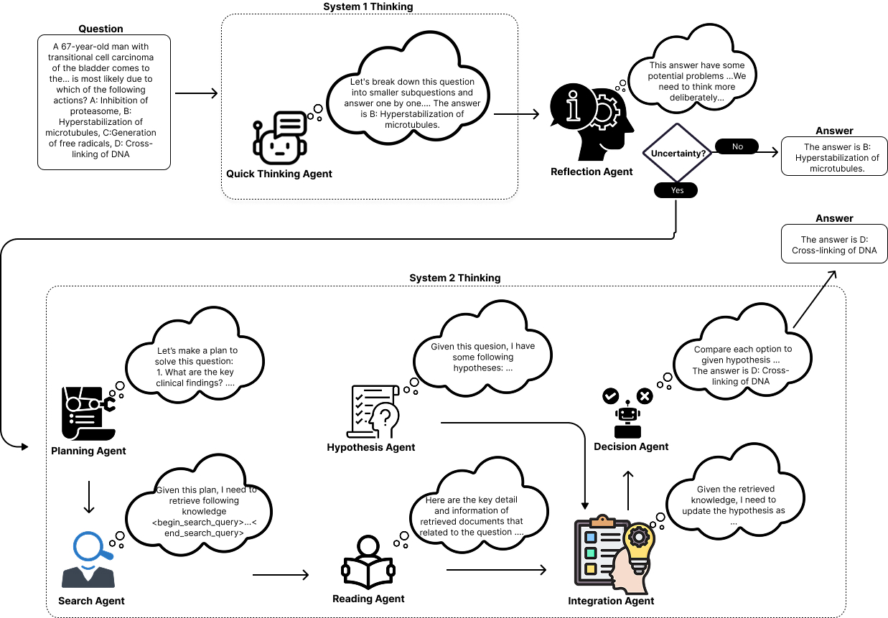

# PRIME: Planning and Retrieval-Integrated Memory for Enhanced Reasoning

This repository contains necessary scripts to run **PRIME**.

## Intro 

We propose **PRIME:**, Planning and Retrieval-Integrated Memory for Enhanced Reasoning approach that significantly improves reasoning of large language models without fine-tuning or superior models.

<p align="center">
  
</p>

## Prerequisites

- Python 3.10
- CUDA 12
- newest PyTorch
- newest `transformers`
- newest `vllm`

## Usage

### PRIME

Here is an example to run PRIME:

```bash
bash scripts/run_generate_medqa_8b.sh
```

The script `run_gsm8k_generator.sh` includes several configurable parameters:
- `--dataset_name`: Name of the dataset (choose from [MedQA, MedMCQA, MMLU, Musique, TweWiki, HotpotQA]).
- `--test_json_filename`: Filename for the test JSON (default: test).
- `--model_ckpt`: Path to the model checkpoint.

Make sure to adjust these parameters according to your requirements.